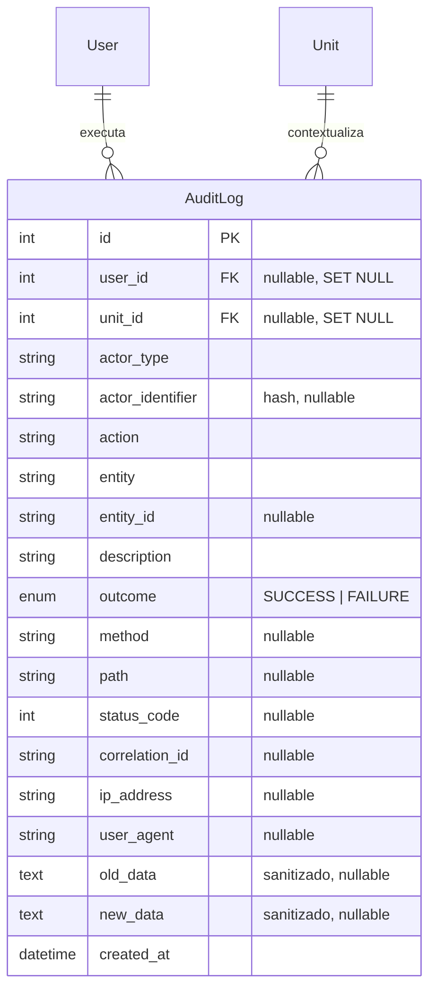

# Auditoria da plataforma MeatShop

## Objetivo

O trilho de auditoria registra operações mutáveis relevantes da API e eventos críticos fora do HTTP. A consulta é global e exclusiva do `SUPER_ADMIN`.

## Cobertura

- `POST`, `PUT`, `PATCH` e `DELETE`: sucesso e falha, inclusive autenticação e autorização recusadas.
- Ações semânticas: login, logout, senha, pedidos, aprovação, suporte e chat.
- Contexto: responsável, unidade, resultado, HTTP, recurso, correlação, IP, agente, data/hora e snapshots quando disponíveis.
- Operações anônimas: identificadores são representados somente por hash SHA-256.

## Segurança e LGPD

- Senhas, segredos e tokens são substituídos por `[REDACTED]`.
- CPF, CNPJ, e-mail e telefone são mascarados nos snapshots.
- Nenhuma mensagem de chat é copiada para a auditoria WebSocket.
- A tabela é append-only: o gatilho `TRG_audit_logs_append_only` recusa `UPDATE` e `DELETE`.
- Excluir usuário ou unidade preserva o evento por `ON DELETE SET NULL`.
- O logger HTTP grava somente o caminho, nunca os parâmetros da query.

## API administrativa

- `GET /audit-logs`: paginação e filtros completos.
- `GET /audit-logs/summary`: totais, sucessos, falhas e últimas 24 horas.
- `GET /audit-logs/:id`: detalhe e snapshots sanitizados.
- `GET /audit-logs/export`: CSV sanitizado, limitado a 10.000 eventos.

## Limite operacional

A auditoria não desfaz uma operação de negócio já confirmada se sua própria persistência falhar; a falha é elevada ao logger técnico. Fluxos financeiros futuros que exijam atomicidade absoluta devem usar outbox transacional.

## Trecho do DER

No DER principal, substitua a definição antiga de `AuditLog` por este bloco e mantenha as relações próximas de `User` e `Unit`.
