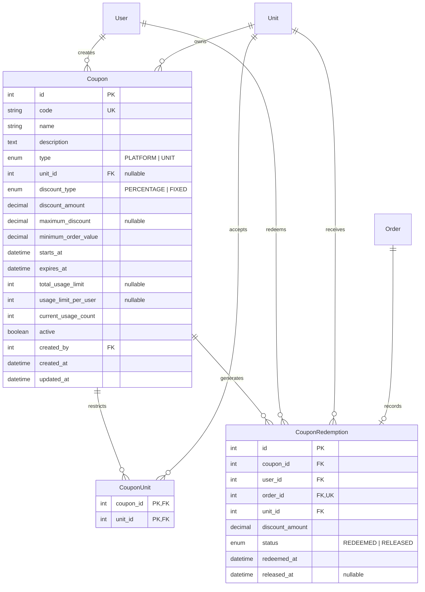

# Cupons da plataforma e das unidades

## Modelo de negócio

- `PLATFORM`: criado e administrado apenas por `SUPER_ADMIN`. Sem unidades selecionadas vale para toda a plataforma; com seleção, vale somente nelas.
- `UNIT`: pertence a uma unidade e pode ser administrado por usuários ativos com `MANAGE_PRODUCTS` (`OWNER` e `MANAGER`; `SUPER_ADMIN` mantém bypass global).

Todo cupom possui modalidade única (`PERCENTAGE` ou `FIXED`), início, término, pedido mínimo e pode ter teto de desconto, limite total e limite por cliente. Códigos são normalizados em maiúsculas e permanecem únicos globalmente.

## Consumo e concorrência

Na criação do pedido, o cupom é carregado com bloqueio pessimista. Elegibilidade, limites e cálculo são validados dentro da mesma transação que cria pedido, itens, pagamento e `CouponRedemption`. O contador só é incrementado se toda a transação concluir. O cancelamento libera o resgate e decrementa o contador.

O desconto é aplicado somente ao subtotal; a taxa de entrega não recebe desconto. Desconto fixo e desconto percentual com teto nunca ultrapassam o subtotal.

## Endpoints

- `GET /coupons`: listagem paginada e contextual.
- `POST /coupons`: criação conforme escopo e autorização.
- `GET /coupons/validate/:code?unit_id=&subtotal=`: simulação autenticada para o cliente.
- `GET /coupons/:id`: detalhe administrativo.
- `PATCH /coupons/:id`: edição, ativação e desativação.
- `GET /coupons/:id/redemptions`: até 500 utilizações recentes.

## DER

