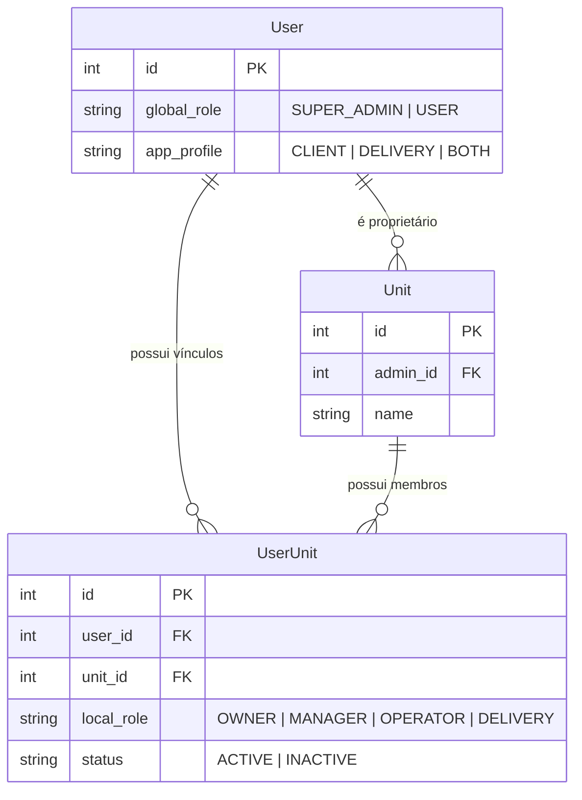

# Controle de acesso do painel

O perfil global (`SUPER_ADMIN` ou `USER`) e o perfil móvel (`CLIENT`, `DELIVERY` ou `BOTH`) são independentes. O painel depende exclusivamente de `UserUnit`, seu status e seu papel local.

| Papel | Dashboard | Pedidos | Produtos | Categorias | Financeiro | Membros | Unidade |
|---|---:|---:|---:|---:|---:|---:|---:|
| OWNER | ✓ | ✓ | ✓ | ✓ | ver/editar | ✓ | ✓ |
| MANAGER | ✓ | ✓ | ✓ | ✓ | ver/editar | ✓ | — |
| OPERATOR | ✓ | ✓ | ✓ | ✓ | — | — | — |
| DELIVERY | — | — | — | — | — | — | — |

`SUPER_ADMIN` ignora a matriz, acessa todas as unidades e escolhe a unidade ativa. Vínculos `INACTIVE` nunca concedem acesso. `GET /users/me` entrega o contexto para a interface, mas cada ação é novamente autorizada no backend.

## DER atualizado

